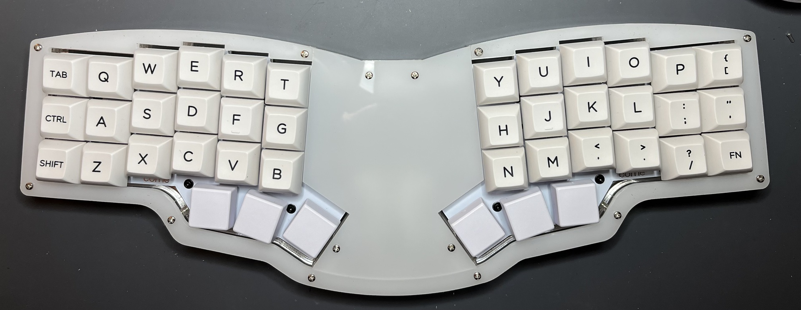

# Wat

This is a laser cut case for the [Corne split
keyboard](https://github.com/foostan/crkbd) which turns it into a single object.

Why on earth would I do that? I love my corne keyboards but they can be a bit
awkward on, say, the couch. I wanted something to put on my lap but still be a
corne. This is, of course, inspired by the
[reviung41](https://github.com/gtips/reviung/tree/master/reviung41)

The halves are tiled by 5 degrees which has worked well for my hands.

The center section is removable independent of the rest of the case, allowing
easy access to the electronics without tearing apart the whole case. (Could also
use it to swap out stickers or art or whatever.)

The [images](images/) directory contains photos of a unit in
[MDF/Plywood](images/wood/README.md) and more of the [acrylic build with
RGB](images/acrylic_rgb/README.md)

# Development

I use Shapr3d for all my CAD-ish work and the source for the DXFs lives there.
`dxf/Core.dxf` is an export of that file.

# Use

## Cut Parts

`dxf/All Parts.dxf` contains all the individual parts. When I cut my cases, I
drag the `All Parts.dxf` file into the Glowforge site and pick out the pieces I
need. 

The thickness of the parts is really dealer's choice. I print the top and bottom
plates in 3mm. For a lower profile, I use two 6mm middle plates. My usual build
is a high profile which uses two 6mm middle plates and one 3mm middle plate.

## Bill of Materials

The unibody case is designed to hold a Corne using the standard FR4 switch
plate. So, perhaps obviously, you'll need one for those.

For the case itself:
* 14 standoffs. (The case is designed for round standoffs. Hex standoffs will
  not fit.)
* 28 M2 screws, at least 8mm long
* 10 screws to hold the keyboard itself
* [small trrs cable](https://www.mouser.com/ProductDetail/474-CAB-14163)

I'm not going to provide a measurement on the standoffs. I know that seems like
I'm being a bit of a jerk but there's a problem with laser cut media. Despite
measurements like 3mm or 1/8", the plates are never that exact size. There's
usually a 10% tolerance either way in thickness. In the end, this makes the
exact thickness of the plates, and thus the length of standoff needed, somewhat
non-deterministic. For instance, I cut one out of two 6mm plates and another out
of one 6mm plate and two 3mm plates (I ran out of 6mm). The one with two 6mm
plates needs 11mm standoffs while the other needs 13mm standoffs. The only way
to know what size standoffs you need is to cut the case and measure.

# Copyright / License

Copyright 2022 - sungo

This work is licensed under the Creative Commons
Attribution-NonCommercial-ShareAlike 4.0 International License. For details, see
[LICENSE.md](LICENSE.md)

