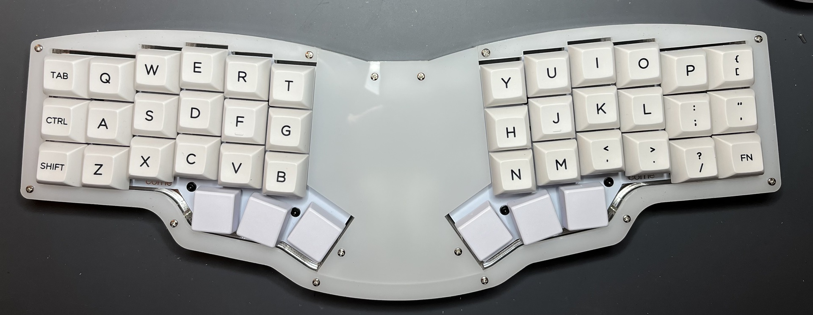

This keyboard uses a bottom plate that is matte on one side, clear middle
plates, and a top "milky white" plate. The acrylic was sourced from [Houston
Acrylic](https://houstonacrylic.com) and cut on a Glowforge.

